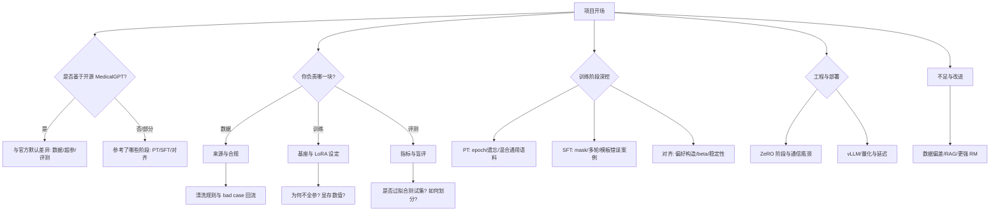

# L19 简历包装与项目描述

> **一句话精髓：好的项目描述 = STAR 法则 + 量化数据**

---

## 导航

| 链接 | 说明 |
|------|------|
| [← 返回课程总览](../../README.md) | Learn MedicalGPT 主页 |
| [L18 源码逐行精读](../L18-源码逐行精读/README.md) | 上一课（按路线图） |
| [L20 面试高频考点](../L20-面试通关高频考点/README.md) | 下一课：面试题库 |
| [面试速查手册](../../interview/README.md) | 精简版问答（关键词） |
| [核心概念速查表](../../cheatsheets/README.md) | 一页纸速查 |

---

## 〇、本课怎么用（面试前必读）

1. **先诚实盘点**：你真实跑过哪些阶段（PT / SFT / DPO / 推理）？真实数据规模与硬件？真实指标？  
2. **再套模板**：用下文三个版本之一改写成简历 bullet，保证每个技术词背后有一句「为什么」。  
3. **最后对齐 L20**：简历上出现的每个数字、每个缩写，都能在 [L20](../L20-面试通关高频考点/README.md) 里找到对应问答。  
4. **红线**：医疗场景涉及安全与合规，简历与口播避免「替代医生诊断」等表述，改用「辅助信息参考、院内流程支持」等安全句式。

---

## 一、为什么 MedicalGPT 适合写进简历

### 1.1 行业与岗位匹配度高

- **垂直领域大模型**：医疗是强监管、强专业场景。面试官更认可「把通用大模型在垂直域训稳、评清楚」的能力，而不是只会调用云端 API。  
- **完整训练链路叙事**：MedicalGPT 类项目天然覆盖 **增量预训练（PT/CPT）→ 有监督微调（SFT）→ 偏好对齐（RLHF / DPO / ORPO / GRPO 等）**，与 JD 中「大模型训练 / 对齐 / 推理 / 数据工程」高度同构。  
- **开源可复现**：基于公开仓库（如 [MedicalGPT](https://github.com/shibing624/MedicalGPT)）与社区数据，你能讲清 **数据从哪来、脚本怎么跑、实验怎么对比**，降低「项目黑盒」质疑。

### 1.2 技术栈与工程能力可证明（写简历时的「能力映射表」）

| 能力域 | 简历可写「证据」 | 面试时应用一句话 |
|--------|------------------|------------------|
| 数据 | 清洗规则、去重、JSONL schema、指令/偏好格式 | 「我的数据版本用 manifest + hash 管理」 |
| 训练 | LoRA/QLoRA、学习率、batch、DeepSpeed、断点续训 | 「我如何用消融确定 r 与 α」 |
| 对齐 | DPO β、偏好构造、KL/稳定性 | 「偏好噪声如何过滤」 |
| 评估 | 自建题集、盲评、κ 一致率、bad case | 「指标定义与偏差控制」 |
| 部署（可选） | vLLM、量化、延迟、网关 | 「吞吐与 P99 如何测」 |

### 1.3 「可讲故事性」：从痛点到指标的一条线

推荐叙事骨架（口播与简历一致）：

> **痛点**：通用模型在【具体医疗场景】出现术语错误、幻觉、格式不稳。  
> **手段**：在【基座】上做【PT 可选 + SFT + 对齐可选】，用【LoRA/QLoRA】控制成本。  
> **证据**：在【N 条、题型说明】上，【指标名】从 a% 到 b%，并做【消融 x1/x2】。  
> **边界**：合规声明 + 已知不足（数据偏差、评测片面）+ 下一步（RAG / 更强评测）。

### 1.4 诚信边界（写进脑子，比写进简历更重要）

- **动词分级**：主导 / 负责 / 参与 / 协助，与真实贡献一致；团队项目写清接口与产出物。  
- **数字可溯源**：每个百分比都能回答「什么集、什么标注规则、几次实验、方差多大」。  
- **复现与扩展也是价值**：若主要贡献是「复现官方流水线 + 替换数据/超参 + 建立评测」，如实写往往比浮夸「自研千亿医疗大模型」更加分。

---

## 二、STAR 法则：Situation / Task / Action / Result

### 2.1 四个字母分别回答什么（背表 + 会用）

| 字母 | 英文 | 中文 | 必须交代的内容 | 面试官心里在问什么 |
|------|------|------|----------------|---------------------|
| **S** | Situation | 背景 | 业务/课程/科研场景；痛点（幻觉、成本、私有化） | 「这是不是真问题？」 |
| **T** | Task | 任务与目标 | 量化目标、约束（GPU、周期、数据合规） | 「目标可验收吗？」 |
| **A** | Action | 行动 | **你**具体做了什么（数据/训练/评测/工程） | 「你会动手吗？」 |
| **R** | Result | 结果 | 指标 + 效率 + 沉淀物（报告、配置、ckpt） | 「结果可信吗？」 |

### 2.2 MedicalGPT 项目的 STAR「素材库」（按需取用，勿堆砌）

**Situation（择 1～2 句）**

- 中文医疗问答/导诊/考试辅导场景下，通用 Chat 模型**专业度不足**或**不可控**。  
- 课程/课题要求**复现并解释**从 PT 到对齐的大模型训练流水线。

**Task（择 1～2 句）**

- 在【单卡 24G / 多卡 A100】上完成【SFT 或 SFT+DPO】，并在自建测试集上超过某基线。  
- 交付可复现训练配置、评测脚本与实验记录（论文/答辩/组内汇报）。

**Action（务必落到动词 + 名词）**

- **数据**：采集规范、去重、格式转换（Alpaca/ShareGPT）、划分 train/val/test、版本记录。  
- **训练**：基座选型实验、LoRA target 模块、r/α 扫描、学习率与 warmup、梯度裁剪、DeepSpeed ZeRO、监控 loss 与 grad norm。  
- **对齐**：构造偏好对（同 prompt 两回答）、过滤长度偏见、调 DPO β、对比 SFT-only。  
- **评测**：题型设计、自动指标 + 盲评、κ 值、对抗用例与 bad case 回流。

**Result（至少 3 个数字或 2 数字 + 1 效率）**

- **效果**：准确率/胜率/人工一致率从 a→b（写清 N 条与题型）。  
- **成本**：训练时长、显存峰值、可训练参数量占比。  
- **沉淀**：git 提交、数据 hash、checkpoint 命名规范、交接文档。

### 2.3 STAR 完整示例一段（可直接改成你的版本）

> **S**：我们在【场景】试用通用大模型时发现，医学术语与用药建议类回答错误率偏高，且输出风格不适合院内话术规范。  
> **T**：目标是在【硬件条件】下完成领域适配，并在自建【N 条】医疗问答测试集上，将【指标名】相对基座提升【x%】，同时保留基础对话能力不明显下降。  
> **A**：我负责数据与训练方案：将多源语料统一为【格式】并去重；基座选【模型】，用 QLoRA 完成 SFT，仅对 assistant 段计算 loss；随后用【构造方式】得到【M 对】偏好数据做 DPO，β 从【值】起步网格搜索；评测采用自动指标 + 双人盲评。  
> **R**：最终【指标】从【a%】到【b%】；QLoRA 峰值显存约【x】GB，全量训练预估需【y】GB 故未采用；沉淀可复现配置与评测 Notebook，bad case 分类中【比例】来自数据噪声，已回流清洗规则。

### 2.4 STAR 常见错误与改法

| 错误表现 | 面试官推断 | 改法 |
|----------|------------|------|
| 只有 S，没有 R | 「可能没评测或没做完」 | 每个项目至少 2 个数字 + 评测定义 |
| A 全是「我们」且无法拆分 | 「蹭项目」 | 准备 2 个「我独立交付」的细节 |
| R 只有形容词 | 「不可证伪」 | 换成「基线 / 方法 / 集大小 / 方差说明」 |
| 技术词与行动脱节 | 「背概念」 | 每个缩写对应「本项目怎么用」 |

---

## 三、简历项目描述模板（三个版本）

以下 **`【】`** 为占位符；**请替换为你的真实数据**。数字勿编造。

### 3.1 版本 1：初级版（本科 / 实习）

**适用**：课设、实验室辅助、以学习为主；负责数据整理、脚本运行、部分实验与文档。

**写法原则**

- 强调 **复现 + 理解 + 记录**；技术词准确即可，不堆满一行。  
- 结果侧重 **流程跑通 + 小规模对比 + 能讲清原理**。

**模板（粘贴到简历后逐句替换）**

```text
【中文医疗大模型微调实践】（课程设计 / 科研训练）
· 背景：基于开源 MedicalGPT 训练思路，在中文医疗场景下复现「增量预训练（可选）+ 指令微调（SFT）」流程，系统学习大模型领域适配方法。
· 工作：参与医疗文本与指令数据的清洗与格式统一（【Alpaca/ShareGPT】）；在单卡【GPU 型号】上使用 LoRA 完成 SFT；编写简易评测脚本，在自建【N】条问答样本上对比微调前后输出。
· 技术栈：Python、PyTorch、HuggingFace Transformers、PEFT（LoRA）、（可选）DeepSpeed。
· 结果：相对通用基座，【指标名】提升约【x%】（内部测试集）；整理实验日志与可复现训练命令。
```

**措辞库（可替换 bullet 动词）**

| 少用（空） | 推荐（实） |
|------------|------------|
| 熟悉大模型 | 阅读并调试【脚本名】，定位 loss 与 label mask 逻辑 |
| 参与训练 | 在【数据子集】上完成【x】组学习率对比，记录收敛曲线 |
| 了解评测 | 设计【N】条题型模板，完成抽样盲评并统计一致率 |

**初级版常见加分句（据实选用）**

- 「输出 bad case 分类：【数据模板错误 / 截断 / 知识缺失】占比分别为……」  
- 「复现过程中修复【环境/依赖/模板】问题并记录到 Wiki。」

---

### 3.2 版本 2：中级版（硕士 / 1～3 年经验）

**适用**：独立负责子系统（数据管线、某一训练阶段、评测体系）；有对比实验与问题定位经验。

**写法原则**

- STAR 四维齐全；Action 分「数据 / 训练 / 评估」三层展开。  
- 控制 **2～4 个高信号词**（如 QLoRA、DPO、ZeRO-2、vLLM），每个词准备 30 秒解释。

**模板**

```text
【医疗领域大模型训练与对齐】
· 场景：面向【导诊 / 医学考试 / 科研辅助】等应用，通用大模型存在医学事实错误与输出不可控问题，需在有限算力下完成中文医疗领域适配。
· 职责：负责【数据构建 + SFT（+ DPO）】方案设计与实验复盘；搭建对比实验矩阵与内部评测集；与【部署/产品】协作定义交付阈值（如有）。
· 方案：构建【纯文本约 xx GB / 指令数据 xx 万条 / 偏好对 xx 千组】；基座选用【模型名+参数规模】；采用 QLoRA 降低显存并完成 SFT（target 模块【q/v/…】，r=【】，α=【】）；可选阶段引入 DPO，偏好数据来自【采样策略 + 过滤规则 + 人工抽检】；训练侧使用 DeepSpeed ZeRO-【1/2/3】、梯度累积与 bf16；评测结合【自动指标】与【盲评/胜率】。
· 结果：在自建【题型说明】测试集上，【指标】较 SFT 前提升【x%】；SFT+DPO 相对 SFT-only 胜率约【y%】（【M】对对比）；单机【GPU】训练周期约【z】小时；沉淀配置文件、数据版本说明与评测报告。
```

**措辞库**

| 场景 | 推荐表述 |
|------|----------|
| 分工 | 「负责训练与对齐子链路，接口对齐【数据 schema / 推理 API】」 |
| 难点 | 「显存受限下通过 QLoRA + 梯度检查点将峰值控制在【x】GB」 |
| 方法 | 「用消融确定 r∈{8,16,32,64} 时【验证集】最优为【】」 |
| 风险 | 「偏好数据经长度差过滤，降低 DPO 长度偏见风险」 |

---

### 3.3 版本 3：高级版（3 年及以上）

**适用**：主导技术选型、资源评估、合规与协作规范；能讲系统架构与持续迭代路线。

**写法原则**

- 突出 **决策理由** 与 **权衡**（基座、对齐算法、分布式、推理方案）。  
- Result 包含 **成本、延迟、稳定性、规范沉淀**；高级候选人准备 1 个「失败—修复」故事。

**模板**

```text
【医疗大模型全链路训练与推理优化（POC/落地）】
· 背景：在【ToB/院内/科研】场景需在合规前提下交付可审计的医疗问答能力，要求数据可追溯、训练可复现、推理可观测。
· 架构：数据层（多源采集、脱敏、质量分层与版本化）→ 训练层（可选 CPT + SFT + 偏好对齐【DPO/RLHF 等】）→ 评估层（离线基准 + 线上/线下抽检）→ 服务层（【vLLM/TGI】、限流、审计日志、可选安全策略）。
· 个人贡献：主导训练与对齐策略选型，在效果、稳定性与研发成本之间确定【基座 + QLoRA + DPO】组合；设计实验矩阵（数据配比、β、rank、学习率）与消融；推动 DeepSpeed 多卡方案与 checkpoint/配置绑定规范；建立 bad case 复盘与数据回流机制。
· 结果：在【xx 条】业务相关测试集上关键指标提升【x%】；推理侧 P99 延迟【y】（相对基线方案【z%】）；训练成本较初版全参方案下降【w%】；输出 SOP、模型卡/数据卡要点与交接文档。
```

**高级版「决策句式」示例**

- 「选择 DPO 而非完整 RLHF，主因是【团队规模/迭代周期】下 PPO 调试成本高，且偏好数据规模【M】更适合离线对齐。」  
- 「ZeRO-3 在【集群带宽】约束下通信占比过高，回退 ZeRO-2 + 更大梯度累积仍满足显存目标。」

---

### 3.4 三个版本「逐句对照」（帮你选对版本）

| 维度 | 初级 | 中级 | 高级 |
|------|------|------|------|
| 动词 | 参与、协助、完成子任务 | 负责、设计、搭建、对比 | 主导、推动、架构、规范、降本 |
| 技术深度 | 跑通 + 理解 | 消融 + 选型理由 | 权衡 + 风险 + 工程化 |
| 结果 | 小集指标 + 文档 | 多组对比 + 资源数据 | 业务指标 + 延迟成本 + SOP |
| 面试预期 | 原理 + 基础实操 | 深挖超参与对齐 | 系统设计与协作治理 |

---

## 四、关键技术词汇怎么放

### 4.1 放置原则（记住 4 条）

1. **JD 对齐**：JD 出现的词，项目描述里应有 **原词或等价词**（各 1 次即可）。  
2. **金字塔**：标题或首行 **2～4 个最高信号词**；细节在下文 bullet。  
3. **一词一深度**：简历里写的每个缩写，面试要能 **定义 + 本项目用法 + 权衡**。  
4. **密度上限**：同一项目条目不堆超过 **6 个缩写**，否则易被连环追问。

### 4.2 高信号词汇清单（按模块，择要）

| 模块 | 词汇示例 |
|------|----------|
| 数据 | 指令微调、ShareGPT/Alpaca、偏好对、去重、质量分层、PPL 过滤、数据版本 manifest |
| 训练 | CPT/PT、SFT、LoRA、QLoRA、rank、alpha、warmup、余弦调度、梯度裁剪、DeepSpeed、ZeRO、FSDP |
| 对齐 | RLHF、RM、PPO、DPO、ORPO、GRPO、β、KL、偏好噪声 |
| 评估 | 自建基准、盲评、胜率、κ、对抗集、bad case |
| 工程 | checkpoint、续训、混合精度、Flash Attention、vLLM、PagedAttention、API 网关 |

### 4.3 避免「词汇通胀」

- **没做过的不写**：只跑 DPO 不要写「完整 RLHF 上线」。  
- **开源项目名**：写「参考 MedicalGPT 流水线」比含糊「医疗 GPT」更专业。  
- **英文大小写**：LoRA、QLoRA、DPO、PPO 等按社区惯例书写。

---

## 五、量化数据怎么写

### 5.1 常用量化维度与句式

| 类型 | 写法示例 | 注意 |
|------|----------|------|
| 数据量 | 「清洗后纯文本约 **【x】GB**」「指令 **【N】万条**」「偏好 **【M】千对**」 | 区分条数与 token |
| 准确率类 | 「**【N】** 道单选题 Top-1 **62%→78%**」 | 写清题型与划分 |
| 提升幅度 | 「相对 Base，SFT 后人工一致率 **+【x】pct**」 | 说明「相对谁」 |
| 效率 | 「QLoRA 峰值显存 **【a】GB**，全参预估 **【b】GB**」 | 非常加分 |
| 训练成本 | 「**3 epoch**、**【t】小时**、有效 batch **【B】**」 | 体现实操 |
| 推理 | 「vLLM 吞吐 **【x】req/s**（batch=【】，【GPU】）」 | 对比要公平 |

### 5.2 推荐句式（改编后使用）

- 「在自建 **500** 条事实问答上，两名标注者盲评一致率从 **55%** 提升至 **72%**（κ=【0.xx】）。」  
- 「SFT+DPO 相对 SFT-only，在 **200** 对 side-by-side 偏好中胜率 **52%→68%**。」  
- 「r=64、α=128 时验证集 loss 最优，相对 r=8 **【相对变化】**。」

### 5.3 严禁与建议

- **严禁**：伪造榜单排名、虚构论文、虚构线上流量。  
- **建议**：标注「内部测试集 / 单次实验 / 采样误差」，诚实方差反而增信。  
- **医疗场景**：避免夸大疗效；用「辅助参考」「非诊疗结论」类表述。

---

## 六、面试自我介绍中如何引出本项目

### 6.1 结构公式（通用）

- **30 秒**：身份 + 项目一句 + 两个技术词 + 应聘动机。  
- **1 分钟**：背景 + 目标 + 三件事 + 一个数字 + 为什么投贵司。  
- **2 分钟**：1 分钟版 + STAR 展开 Action + 真实难点 1 个 + 协作沉淀 + 钩子（请面试官追问方向）。

### 6.2 30 秒版本（示例口播稿）

> 我是【学校/公司】的【姓名】，方向是 NLP 与大模型应用。最近我主要做了一个中文医疗场景的大模型适配项目：参考 MedicalGPT 的流水线，在【基座】上完成了【SFT 或 SFT+DPO】，用 LoRA/QLoRA 在【单卡/多卡】上跑通并做了小规模评测。技术栈主要是 PyTorch、HuggingFace 和 DeepSpeed。我应聘的是贵司【岗位】，很希望把训练与数据经验用在【业务方向】上。

### 6.3 1 分钟版本（示例口播稿）

> 我【背景一句：专业/工作经历】。最近一段完整工作是医疗大模型领域适配：背景是通用模型在【具体场景】里专业度不够、输出不够可控。我的目标是在【算力条件】下把效果做到可验收，所以我主要做了三件事：第一是数据侧，把【来源】整理成【格式】并做去重和质量过滤；第二是训练侧，在【基座】上用 LoRA/QLoRA 做 SFT，并做了【r/学习率】的对比实验；第三是评测侧，搭了【N】条内部题集，用【自动/人工】方式对比微调前后。结果是【指标】大概提升了【x%】。我关注贵司在【方向】上的积累，所以投递【岗位】。

### 6.4 2 分钟版本（示例口播稿）

> 【接 1 分钟版本，不重复背景】  
> 展开讲下技术细节：SFT 阶段我只对 assistant 计算 loss，避免模型去学「预测用户下一句」；模板严格跟 tokenizer 的 chat_template 对齐，避免训练推理分布不一致。对齐阶段我这边用的是 DPO，偏好对主要来自【同 prompt 不同温度采样 / 两模型对比 / 规则过滤后人工抽检】，β 和学习率做得比较保守，避免一步把模型拉飞。过程中最大的坑是【显存/数据噪声/对齐不稳定】，我通过【具体手段】解决了。协作上我沉淀了【配置+数据版本+评测脚本】，方便复现。如果面试官感兴趣，我可以继续展开数据构造或分布式训练部分。

### 6.5 自我介绍结尾「钩子」示例（任选）

- 「我在 DPO 上做过 β 的网格搜索，如果您感兴趣我可以讲结论与失败案例。」  
- 「评测除了准确率还做了安全拒答抽样，我可以分享标准。」

---

## 七、面试官可能的追问路线（决策树）

### 7.1 Mermaid 决策树（可视化）

> 下图从「项目开场」出发，展示常见追问分叉。准备时：**每个叶节点准备 30～45 秒口播**。



### 7.2 文本版决策树（便于打印）

```text
项目开场
├─ 基于 MedicalGPT 还是自研 pipeline？
│   ├─ 基于 → 差异三件套：数据域 / 超参 / 评测
│   └─ 自研 → 与 MedicalGPT 各阶段对应关系
├─ 你负责什么？
│   ├─ 数据 → 来源、合规、schema、去重、版本
│   ├─ 训练 → 基座理由、LoRA 配置、学习率、是否 CPT
│   └─ 评测 → 题型、盲评、κ、对抗集
├─ 效果可信吗？
│   ├─ 基线是谁？提升 x% 的定义？
│   └─ 消融有哪些？（无 PT、无 DPO、不同 r）
├─ 工程能力
│   ├─ 显存峰值？如何降？
│   └─ 多卡？ZeRO？故障恢复？
└─ 落地与风险
    ├─ 医疗合规话术
    └─ 幻觉与知识时效（RAG/拒答）
```

**使用建议**：只深挖与你简历一致的分支；不一致的内容不要写进简历。

---

## 八、项目难点和亮点怎么准备

### 8.1 难点：准备 2 个「真实故事」（STAR 微型版）

| 难点方向 | 现象 | 可讲行动 | 结果/取舍 |
|----------|------|----------|-----------|
| 显存不足 | OOM / batch 只能开 1 | QLoRA、checkpointing、截断、ZeRO | 峰值【x】GB，效果损失【可接受/可量化】 |
| 数据噪声 | loss 降但生成差 | PPL 过滤、规则、抽检回流 | bad case 某类下降【%】 |
| 对齐不稳 | 胡编或过度拒答 | 调 β、减 LR、混合 SFT、净偏好 | 胜率曲线变化 |
| 模板错误 | 角色乱、空输出 | 对齐 chat_template、单测编解码 | 修复前后对比样例 |
| 评测可信 | 指标与主观矛盾 | 双盲、分层题型、对抗题 | κ 与方差说明 |

**讲述公式**：现象 → 假设原因 → 你做的实验 → 数据支持的结论 → 遗留问题。

### 8.2 亮点：与 JD 对齐的「可验证表述」

- **完整 pipeline**：PT→SFT→DPO 跑通 + 配置与文档。  
- **工程降本**：QLoRA、ZeRO、训练时长对比。  
- **数据质量**：可复现的清洗与偏好过滤规则。  
- **评估体系**：不止 loss，还有盲评/胜率/安全抽检。  
- **合规意识**：脱敏、免责、日志审计（如有）。

### 8.3 避免「假亮点」

- 「通读仓库」不如「定位 supervised_finetuning 中 label mask 与模板关系」。  
- 「调了很多参数」要说清 **Top-3 敏感超参** 与证据链。

---

## 九、简历中的常见错误

| 错误 | 后果 | 改法 |
|------|------|------|
| 项目名称浮夸 | 不信任 | 用「医疗领域大模型微调与对齐实践」 |
| 只堆术语无数字 | 像抄 JD | 每个阶段至少 1 个可验证数字 |
| 团队成果写成「我」 | 追问露馅 | 用主导/负责/参与分级 |
| 只写模型不写场景 | 不知道价值 | 首句写「场景 + 目标」 |
| 「大量、显著提升」 | 空洞 | 写清规模、基线、集定义 |
| 忽略合规 | 医疗场景雷区 | 脱敏、授权数据、免责声明产品策略 |
| 一行超长 | HR 难扫读 | 3～5 bullet，每行一个主题 |
| 简历与口播不一致 | 诚信风险 | 以真实实验记录为准同步修改 |

---

## 十、差简历 vs 好简历（同一事实两种写法）

**差**

> 深入研究大模型，精通 RLHF，医疗 GPT 效果极佳。

**好**

> 在【基座】上完成中文医疗指令 SFT（【N】万条）与 DPO 对齐（【M】对偏好），自建【K】条测试集上【指标】较 Base 提升【x%】；QLoRA 峰值显存【y】GB，训练【z】小时；配置与评测脚本已沉淀。

---

## 十一、面试前 10 分钟自检清单

- [ ] 90 秒内 STAR 讲完项目  
- [ ] 基座选型 **2 理由 + 1 代价**  
- [ ] 至少 **3 个数字**（数据量、epoch、显存、指标）  
- [ ] **1 个失败与修复** 故事  
- [ ] 简历上最难的 **3 个缩写** 各能讲 30 秒  
- [ ] 医疗 **合规安全句** 能脱口而出  

---

## 下一课

进入 **[L20 面试通关高频考点](../L20-面试通关高频考点/README.md)**，把简历上的每一句话练成可口播的标准答案。
