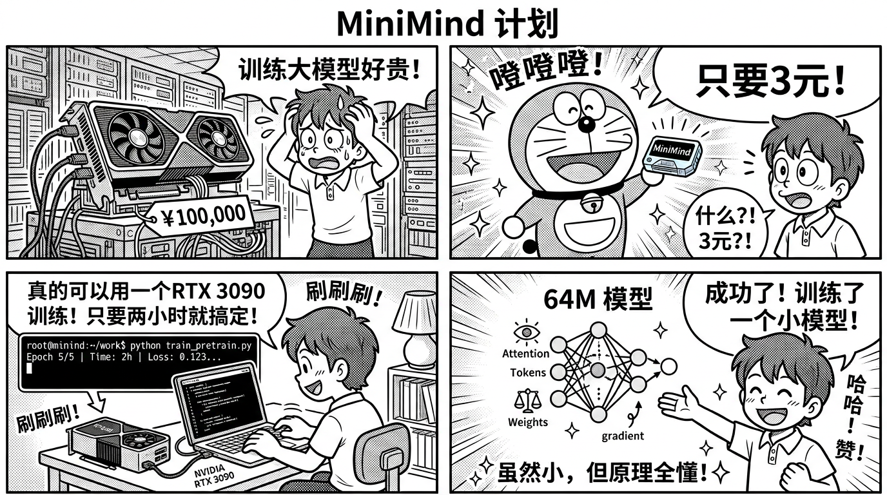

# MiniMind 项目全景 — 从零理解大模型

> 本章帮助你在 30 分钟内理解 MiniMind 项目的全貌，为什么它适合写进简历，以及它和 MedicalGPT 的关系。



---

## 一、MiniMind 是什么？

MiniMind 是一个完全开源的 **从零训练大语言模型** 项目，由 jingyaogong 创建，GitHub 上获得 **45K+ Star**。

### 核心卖点

| 维度 | 数据 |
|------|------|
| 参数量 | 64M（Dense）/ 198M（MoE，激活 64M） |
| 训练成本 | 约 3 元人民币（GPU 租用） |
| 训练时间 | 约 2 小时（单卡 3090） |
| 模型体积 | GPT-3 的 1/2700 |
| 实现方式 | 纯 PyTorch，零第三方高层抽象 |
| 覆盖流程 | PT → SFT → LoRA → DPO → RLHF(PPO/GRPO/CISPO) → 蒸馏 → Tool Use |

### 一句话定位

> **MiniMind = 大模型的「Hello World」**
> 
> 用最小的成本、最少的代码，让你亲手跑通大模型训练的每一个环节。

---

## 二、为什么 MiniMind 适合面试？

### 2.1 面试官视角

面试官想看到的不是「用了 LLaMA-Factory 点了几下按钮」，而是：

1. **你是否理解底层原理** — MiniMind 纯 PyTorch 实现，每一行代码都可以解释
2. **你是否有动手能力** — 从零搭建比调参更能体现工程能力
3. **你是否理解训练全流程** — PT/SFT/DPO/LoRA 每个阶段都走过
4. **你是否能独立排查问题** — 小模型训练中遇到的问题与大模型一样

### 2.2 和 MedicalGPT 形成互补

```
MedicalGPT（工业级框架）          MiniMind（从零实现）
├── 基于 HuggingFace TRL          ├── 纯 PyTorch 原生
├── 支持 7B-70B 大模型             ├── 64M 小模型
├── 医疗领域适配                   ├── 通用语言模型
├── 展示「怎么用」                 ├── 展示「怎么做」
└── 工程经验                       └── 原理理解
```

**面试策略**：先用 MiniMind 展示你对原理的理解，再用 MedicalGPT 展示你的工程实战能力。

---

## 三、项目架构总览

### 3.1 整体架构

```
MiniMind 项目架构
=================

输入层                    模型层                      输出层
──────                   ──────                     ──────
                   ┌──────────────────┐
 文本输入 ──────>  │  Tokenizer       │
                   │  (自训练 BPE)     │
                   └────────┬─────────┘
                            │
                   ┌────────▼─────────┐
                   │  Embedding       │
                   │  + RoPE 位置编码  │
                   └────────┬─────────┘
                            │
                   ┌────────▼─────────┐
                   │  N × Transformer │
                   │  Decoder Block   │  ×16 层
                   │  ┌─────────────┐ │
                   │  │ RMSNorm     │ │
                   │  │ GQA Attn    │ │
                   │  │ RMSNorm     │ │
                   │  │ SwiGLU FFN  │ │
                   │  └─────────────┘ │
                   └────────┬─────────┘
                            │
                   ┌────────▼─────────┐
                   │  RMSNorm         │
                   │  + Linear Head   │ ──────>  下一个 Token
                   └──────────────────┘
```

### 3.2 关键组件对齐（MiniMind vs Qwen3）

| 组件 | MiniMind-3 | Qwen3 | 说明 |
|------|-----------|-------|------|
| 归一化 | RMSNorm | RMSNorm | 相同 |
| 位置编码 | RoPE | RoPE | 相同 |
| 注意力 | GQA | GQA | 相同，MiniMind 4 KV head |
| FFN | SwiGLU | SwiGLU | 相同 |
| 激活函数 | SiLU | SiLU | 相同 |
| 词表大小 | 6400 | 151936 | MiniMind 精简词表 |
| 层数 | 16 | 32-80 | MiniMind 更少层 |
| 隐藏维度 | 512 | 2048-8192 | MiniMind 更小 |

### 3.3 训练流程全景

```
阶段一：预训练 (PT)                阶段二：监督微调 (SFT)
─────────────────                ──────────────────
pretrain_hq.jsonl ──>             sft_mini_512.jsonl ──>
train_pretrain.py                 train_sft.py
│                                 │
│  next-token prediction          │  instruction following
│  ~1-1.5 小时                     │  ~30 分钟
│                                 │
▼                                 ▼

阶段三：偏好对齐                    阶段四：进阶（可选）
──────────────                    ─────────────────
dpo.jsonl ──>                     LoRA 微调
train_dpo.py                      RLHF (PPO/GRPO/CISPO)
│                                 模型蒸馏
│  preference alignment           Tool Use / Agentic RL
│  ~20 分钟                        多模态 (MiniMind-V)
│
▼

部署推理
──────
eval_model.py / web_server.py
兼容 transformers / vllm / ollama
```

---

## 四、核心文件清单

| 文件 | 作用 | 面试重要性 |
|------|------|-----------|
| `model/model.py` | 模型架构定义（Attention、FFN、TransformerBlock） | 极高 |
| `model/model_moe.py` | MoE 变体模型 | 高 |
| `train_pretrain.py` | 预训练脚本 | 高 |
| `train_sft.py` | SFT 微调脚本 | 高 |
| `train_dpo.py` | DPO 对齐脚本 | 高 |
| `train_lora.py` | LoRA 微调脚本 | 高 |
| `train_rl.py` | 强化学习训练（PPO/GRPO/CISPO） | 中 |
| `train_distill.py` | 知识蒸馏 | 中 |
| `tokenizer/train_tokenizer.py` | Tokenizer 训练 | 中 |
| `eval_model.py` | 模型评估 | 中 |
| `web_server.py` | OpenAI API 兼容服务 | 中 |
| `config.py` | 超参数配置 | 中 |

---

## 五、面试30秒速讲

> 「我从零实现了一个 64M 参数的语言模型 MiniMind，基于纯 PyTorch 原生代码，不依赖 HuggingFace 高层封装。项目覆盖了 Tokenizer 训练、预训练、SFT 微调、DPO 偏好对齐和 LoRA 高效微调全流程。模型架构对齐 Qwen3，使用 RMSNorm + RoPE + GQA + SwiGLU。整个训练过程在单卡 3090 上 2 小时完成，成本约 3 元。通过这个项目，我深入理解了大模型训练的每一个环节，从 Attention 计算到 DPO Loss 推导都可以从代码层面解释。」

---

## 六、与本仓库其他内容的关系

```
本仓库学习路径
=============

MedicalGPT 体系（L01-L20）         MiniMind 体系（本目录）
├── 理论知识                        ├── 动手实现
├── 工业级框架使用                   ├── 从零搭建
├── 医疗领域适配                    ├── 通用模型原理
└── 面试八股文答案                  └── 代码级面试回答

                    ↓ 结合使用 ↓

              面试时展示两个维度：
              1. 原理理解（MiniMind）
              2. 工程实战（MedicalGPT）
```

---

> **下一章**：[02-从零搭建.md](./02-从零搭建.md) — 手把手教你跑通 MiniMind 全流程
