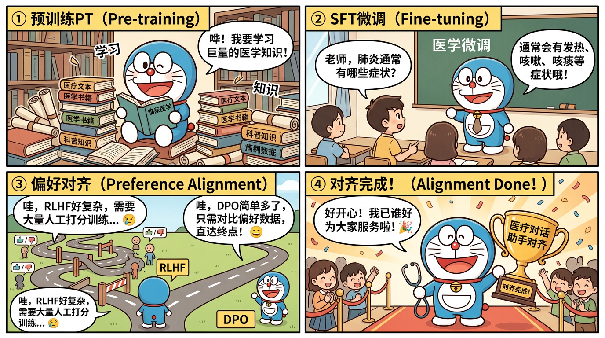

# MiniMind 从零搭建指南 — 小白也能跑通

> 本章手把手教你从环境准备到模型部署，全流程跑通 MiniMind。预计耗时 3-4 小时（含下载时间）。



---

## 一、环境准备

### 1.1 硬件要求

| 配置 | 最低要求 | 推荐配置 |
|------|---------|---------|
| GPU | GTX 1080 (8GB) | RTX 3090 (24GB) |
| 内存 | 16GB | 32GB |
| 硬盘 | 20GB 可用空间 | 50GB SSD |
| CUDA | 11.8+ | 12.1+ |

> 没有 GPU？可以使用 AutoDL / Vast.ai 等 GPU 租用平台，3090 约 1-2 元/小时。

### 1.2 软件环境

```bash
# 1. 创建 conda 环境
conda create -n minimind python=3.10 -y
conda activate minimind

# 2. 安装 PyTorch（根据 CUDA 版本选择）
# CUDA 12.1
pip install torch torchvision torchaudio --index-url https://download.pytorch.org/whl/cu121

# 3. 克隆项目
git clone https://github.com/jingyaogong/minimind.git
cd minimind

# 4. 安装依赖
pip install -r requirements.txt
```

### 1.3 验证环境

```python
import torch
print(f"PyTorch version: {torch.__version__}")
print(f"CUDA available: {torch.cuda.is_available()}")
print(f"GPU: {torch.cuda.get_device_name(0)}")
print(f"GPU Memory: {torch.cuda.get_device_properties(0).total_mem / 1024**3:.1f} GB")
```

---

## 二、数据准备

### 2.1 下载数据集

从 ModelScope 或 HuggingFace 下载：

```bash
# ModelScope（国内更快）
# 预训练数据
wget https://modelscope.cn/datasets/jingyaogong/minimind_dataset/resolve/master/pretrain_hq.jsonl

# SFT 数据
wget https://modelscope.cn/datasets/jingyaogong/minimind_dataset/resolve/master/sft_mini_512.jsonl

# DPO 数据
wget https://modelscope.cn/datasets/jingyaogong/minimind_dataset/resolve/master/dpo.jsonl
```

### 2.2 数据格式说明

**预训练数据**（pretrain_hq.jsonl）：
```json
{"text": "一段连续的中文文本..."}
```

**SFT 数据**（sft_mini_512.jsonl）：
```json
{
  "conversations": [
    {"role": "user", "content": "什么是感冒？"},
    {"role": "assistant", "content": "感冒是一种常见的上呼吸道感染..."}
  ]
}
```

**DPO 数据**（dpo.jsonl）：
```json
{
  "prompt": "解释什么是高血压",
  "chosen": "高血压是指动脉血压持续升高的慢性病...",
  "rejected": "高血压就是血压高了，吃点药就好了..."
}
```

---

## 三、第一步：预训练（约 1-1.5 小时）

### 3.1 理解预训练

预训练的目标是让模型学会「读」文本 — 给定前面的词，预测下一个词（Next Token Prediction）。

```
输入：  今天 天气 真
目标：  天气 真   好
损失：  CrossEntropyLoss(预测, 目标)
```

### 3.2 配置参数

核心参数在 `config.py` 中：

```python
# 模型结构参数
dim = 512             # 隐藏层维度
n_layers = 16         # Transformer 层数
n_heads = 8           # 注意力头数
n_kv_heads = 4        # KV 头数（GQA）
vocab_size = 6400     # 词表大小
max_seq_len = 512     # 最大序列长度

# 训练参数
batch_size = 32
learning_rate = 5e-4
epochs = 2
```

### 3.3 开始训练

```bash
python train_pretrain.py
```

### 3.4 观察训练日志

正常的训练日志应该是这样的：

```
Epoch 1/2, Step 100/5000, Loss: 7.823, LR: 0.000125
Epoch 1/2, Step 200/5000, Loss: 6.451, LR: 0.000250
Epoch 1/2, Step 500/5000, Loss: 4.872, LR: 0.000500
...
Epoch 2/2, Step 5000/5000, Loss: 3.156, LR: 0.000050
```

**关键指标**：
- Loss 应该稳步下降（不一定单调，但趋势向下）
- 如果 Loss 突然变成 NaN → 检查 LR 是否太大
- 如果 Loss 下降很慢 → 检查数据是否正确加载

### 3.5 常见问题排查

| 问题 | 原因 | 解决方案 |
|------|------|---------|
| CUDA out of memory | 显存不足 | 减小 batch_size 或 max_seq_len |
| Loss 不下降 | LR 太小或数据问题 | 检查数据格式，调大 LR |
| Loss = NaN | LR 太大或梯度爆炸 | 减小 LR，加 grad_clip |
| 训练很慢 | 数据加载瓶颈 | 增加 num_workers |

---

## 四、第二步：监督微调 SFT（约 30 分钟）

### 4.1 理解 SFT

SFT 是教模型「回答问题」。预训练后的模型只会续写文本，SFT 让它学会理解指令并生成有用的回答。

```
[预训练后]
输入: "什么是感冒？"
输出: "什么是流感？什么是发烧？..."  (只会联想，不会回答)

[SFT 后]
输入: "什么是感冒？"
输出: "感冒是一种常见的上呼吸道感染，主要由病毒引起..."  (学会回答)
```

### 4.2 关键技术点

- **只计算 assistant 部分的 loss**：user 的输入是已知的，只需要学习怎么回答
- **Chat Template**：训练和推理必须使用一致的对话模板
- **数据质量 > 数量**：1 万条高质量数据 > 10 万条低质量数据

### 4.3 开始训练

```bash
python train_sft.py
```

### 4.4 验证 SFT 效果

```bash
python eval_model.py
# 或者启动交互式对话
python web_server.py
```

试试这些测试问题：
- "你好，请介绍一下你自己"
- "什么是人工智能？"
- "1+1等于几？"

---

## 五、第三步：DPO 偏好对齐（约 20 分钟）

### 5.1 理解 DPO

DPO 是教模型分辨「好回答」和「坏回答」。通过对比学习，让模型更倾向于生成人类偏好的回答。

```
同一个问题的两个回答：
  ✓ Chosen（好）: "高血压是指动脉血压持续高于正常值..."
  ✗ Rejected（坏）: "就是血压高了呗..."

DPO 让模型学会：生成 Chosen 风格的回答，避免 Rejected 风格
```

### 5.2 DPO Loss 直觉

```
L = -log σ(β × (log P(好回答) - log P_ref(好回答) - log P(坏回答) + log P_ref(坏回答)))

翻译成人话：
- 增大「好回答」的概率
- 减小「坏回答」的概率
- 但不要偏离原始模型太远（β 控制）
```

### 5.3 开始训练

```bash
python train_dpo.py
```

### 5.4 对比效果

DPO 前后对同一问题的回答对比：

```
问题: "头疼怎么办？"

DPO 前: "头疼可以吃止痛药。" (简单粗暴)

DPO 后: "头疼的原因有很多，建议您：
        1. 先充分休息，保证睡眠
        2. 如果持续不缓解，建议就医检查
        3. 避免自行用药，特别是频繁使用止痛药
        请注意：如果伴有视力模糊、呕吐等症状，请立即就医。"
        (更安全、更详细、更负责)
```

---

## 六、进阶：LoRA 微调

### 6.1 为什么用 LoRA

全参数微调需要存储完整的梯度和优化器状态，显存占用大。LoRA 只训练两个小矩阵，显存节省 80%+。

### 6.2 实操

```bash
python train_lora.py
```

### 6.3 LoRA 关键参数

```python
lora_r = 8          # 秩，越大越强但越耗显存
lora_alpha = 16     # 缩放系数，常设为 2r
target_modules = ["q_proj", "v_proj"]  # 应用到哪些层
```

---

## 七、进阶：强化学习（RLHF）

### 7.1 PPO / GRPO / CISPO

```bash
python train_rl.py --method grpo  # 或 ppo / cispo
```

MiniMind 支持三种强化学习方法：
- **PPO**：经典方法，需要 Critic 模型
- **GRPO**：DeepSeek 提出，无需 Critic，组内相对排名
- **CISPO**：约束满足的偏好优化

---

## 八、部署与推理

### 8.1 本地推理

```bash
python eval_model.py
```

### 8.2 启动 API 服务

```bash
python web_server.py
# 兼容 OpenAI API 格式
# curl http://localhost:8000/v1/chat/completions -d '...'
```

### 8.3 使用 transformers 加载

```python
from transformers import AutoModelForCausalLM, AutoTokenizer

model = AutoModelForCausalLM.from_pretrained("jingyaogong/MiniMind-3")
tokenizer = AutoTokenizer.from_pretrained("jingyaogong/MiniMind-3")

inputs = tokenizer("你好", return_tensors="pt")
outputs = model.generate(**inputs, max_new_tokens=100)
print(tokenizer.decode(outputs[0]))
```

---

## 九、完整训练时间表

| 阶段 | 时间 | 产出 | 面试价值 |
|------|------|------|---------|
| 环境搭建 | 30min | conda 环境 + 项目克隆 | - |
| 数据下载 | 15min | 3 个 jsonl 文件 | 理解数据格式 |
| 预训练 | 60-90min | base 模型 | 理解 CLM |
| SFT | 30min | chat 模型 | 理解指令微调 |
| DPO | 20min | aligned 模型 | 理解偏好对齐 |
| LoRA（可选） | 15min | LoRA 权重 | 理解高效微调 |
| RL（可选） | 30min | RL 模型 | 理解强化学习 |
| **总计** | **3-4h** | **完整训练流水线** | **全流程可讲** |

---

## 十、训练过程中的关键观察点（面试素材）

训练过程中记录以下数据，面试时可以作为具体案例：

1. **预训练 Loss 曲线**：从 ~8 降到 ~3，说明模型在学习语言规律
2. **SFT 前后对比**：同一问题的回答质量变化
3. **DPO 前后对比**：回答的安全性和详细度提升
4. **LoRA vs 全参**：显存对比（记录具体数字）
5. **训练中遇到的问题**：OOM、Loss 不降、生成乱码等 → 怎么解决的

---

> **下一章**：[03-源码精读.md](./03-源码精读.md) — 逐行理解 MiniMind 的核心代码
