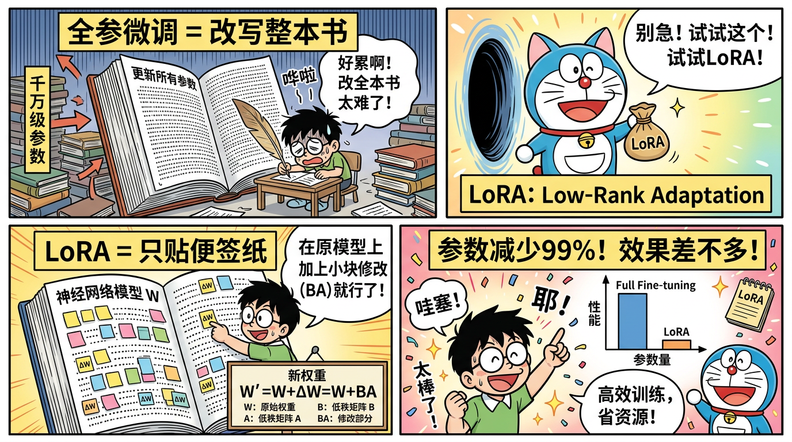

# MiniMind 源码精读 — 逐行理解核心代码

> 本章带你深入 MiniMind 的核心代码，理解每一个组件的实现。面试中被问到「你能解释一下 Attention 的实现吗？」时，你能从代码层面回答。

---

## 一、模型架构总览

MiniMind 的模型定义在 `model/model.py` 中，核心结构如下：

```python
class MiniMindModel:
    Embedding(vocab_size, dim)           # 词嵌入
    layers = [TransformerBlock] × n_layers   # N 个 Transformer 块
    norm = RMSNorm(dim)                  # 最终归一化
    output = Linear(dim, vocab_size)     # 输出投影
```

---

## 二、RMSNorm — 归一化

### 2.1 代码解析

```python
class RMSNorm:
    def __init__(self, dim, eps=1e-6):
        self.eps = eps
        self.weight = nn.Parameter(torch.ones(dim))
    
    def forward(self, x):
        # 计算 RMS（均方根）
        rms = torch.sqrt(torch.mean(x ** 2, dim=-1, keepdim=True) + self.eps)
        # 归一化并缩放
        return x / rms * self.weight
```

### 2.2 面试要点

- **vs LayerNorm**：RMSNorm 省去了减均值的步骤，只做 RMS 归一化，计算量更少
- **为什么有效**：LLM 训练中，减均值的贡献很小，去掉不影响效果
- **eps 的作用**：防止除零错误
- **weight 参数**：可学习的缩放因子，让模型决定每个维度的重要性

---

## 三、RoPE — 旋转位置编码

### 3.1 核心思想

RoPE 把位置信息编码为「旋转」——位置 m 的向量被旋转了 m×θ 度。两个 token 之间的注意力只取决于它们的相对距离。

### 3.2 代码解析

```python
def precompute_freqs_cis(dim, max_seq_len, theta=10000.0):
    # 计算频率：θ_i = 10000^(-2i/d)
    freqs = 1.0 / (theta ** (torch.arange(0, dim, 2).float() / dim))
    
    # 位置索引 × 频率 = 角度
    t = torch.arange(max_seq_len)
    freqs = torch.outer(t, freqs)  # (seq_len, dim/2)
    
    # 转为复数形式：e^(iθ) = cos(θ) + i·sin(θ)
    freqs_cis = torch.polar(torch.ones_like(freqs), freqs)
    return freqs_cis

def apply_rotary_emb(xq, xk, freqs_cis):
    # 将 q, k 视为复数
    xq_complex = torch.view_as_complex(xq.reshape(*xq.shape[:-1], -1, 2))
    xk_complex = torch.view_as_complex(xk.reshape(*xk.shape[:-1], -1, 2))
    
    # 复数乘法 = 旋转
    xq_out = torch.view_as_real(xq_complex * freqs_cis).flatten(-2)
    xk_out = torch.view_as_real(xk_complex * freqs_cis).flatten(-2)
    return xq_out, xk_out
```

### 3.3 面试要点

- **相对位置编码**：q·k 的点积只依赖相对位置差，不依赖绝对位置
- **旋转直觉**：把向量在 2D 平面上旋转，不同频率对应不同"分辨率"
- **外推性**：通过频率缩放（NTK-aware）可以推广到更长序列
- **为什么比正弦编码好**：可学习性更强，且天然支持相对位置

---



## 四、GQA Attention — 分组查询注意力

### 4.1 代码解析

```python
class Attention:
    def __init__(self, dim, n_heads, n_kv_heads):
        self.n_heads = n_heads       # Query 头数，如 8
        self.n_kv_heads = n_kv_heads # KV 头数，如 4（分组）
        self.n_rep = n_heads // n_kv_heads  # 每个 KV 头服务几个 Q 头
        self.head_dim = dim // n_heads
        
        self.wq = nn.Linear(dim, n_heads * self.head_dim, bias=False)
        self.wk = nn.Linear(dim, n_kv_heads * self.head_dim, bias=False)
        self.wv = nn.Linear(dim, n_kv_heads * self.head_dim, bias=False)
        self.wo = nn.Linear(n_heads * self.head_dim, dim, bias=False)
    
    def forward(self, x, freqs_cis, mask=None):
        bsz, seqlen, _ = x.shape
        
        # 线性投影
        q = self.wq(x)  # (B, S, n_heads * head_dim)
        k = self.wk(x)  # (B, S, n_kv_heads * head_dim)
        v = self.wv(x)  # (B, S, n_kv_heads * head_dim)
        
        # 拆分多头
        q = q.view(bsz, seqlen, self.n_heads, self.head_dim)
        k = k.view(bsz, seqlen, self.n_kv_heads, self.head_dim)
        v = v.view(bsz, seqlen, self.n_kv_heads, self.head_dim)
        
        # 应用 RoPE（只对 Q 和 K）
        q, k = apply_rotary_emb(q, k, freqs_cis)
        
        # GQA: 重复 KV 头以匹配 Q 头数量
        k = k.repeat_interleave(self.n_rep, dim=2)  # (B, S, n_heads, head_dim)
        v = v.repeat_interleave(self.n_rep, dim=2)
        
        # 转置用于矩阵乘法
        q = q.transpose(1, 2)  # (B, n_heads, S, head_dim)
        k = k.transpose(1, 2)
        v = v.transpose(1, 2)
        
        # 计算注意力分数
        scores = torch.matmul(q, k.transpose(-2, -1)) / math.sqrt(self.head_dim)
        
        # 因果 mask（下三角）
        if mask is not None:
            scores = scores + mask  # mask 中 -inf 的位置被屏蔽
        
        # Softmax + 加权求和
        attn = F.softmax(scores, dim=-1)
        output = torch.matmul(attn, v)  # (B, n_heads, S, head_dim)
        
        # 合并多头
        output = output.transpose(1, 2).contiguous().view(bsz, seqlen, -1)
        return self.wo(output)
```

### 4.2 面试要点

- **GQA vs MHA vs MQA**：
  - MHA：每个 Q 头有独立的 K、V 头（8Q+8K+8V）
  - MQA：所有 Q 头共享一组 K、V（8Q+1K+1V）→ 太极端
  - GQA：折中，多个 Q 头共享一组 K、V（8Q+4K+4V）→ 推理时 KV Cache 减半
- **为什么 GQA 好**：减少 KV Cache 显存（推理时极重要），效果损失极小
- **因果 mask**：确保位置 i 只能看到 ≤i 的位置（自回归特性）
- **缩放因子 √d**：防止点积过大导致 softmax 饱和

---

## 五、SwiGLU FFN — 前馈网络

### 5.1 代码解析

```python
class FeedForward:
    def __init__(self, dim, hidden_dim, multiple_of=64):
        # 隐藏层维度通常是 dim 的 8/3 倍，对齐到 multiple_of
        hidden_dim = int(2 * hidden_dim / 3)
        hidden_dim = multiple_of * ((hidden_dim + multiple_of - 1) // multiple_of)
        
        self.w1 = nn.Linear(dim, hidden_dim, bias=False)  # gate 投影
        self.w2 = nn.Linear(hidden_dim, dim, bias=False)   # down 投影
        self.w3 = nn.Linear(dim, hidden_dim, bias=False)   # up 投影
    
    def forward(self, x):
        # SwiGLU: w2(SiLU(w1(x)) * w3(x))
        return self.w2(F.silu(self.w1(x)) * self.w3(x))
```

### 5.2 面试要点

- **SwiGLU 公式**：`FFN(x) = W₂ · (SiLU(W₁·x) ⊙ W₃·x)`
- **为什么比 ReLU 好**：门控机制让模型学习「哪些维度该激活」，表达力更强
- **参数代价**：3 个矩阵 vs 传统 FFN 的 2 个矩阵，但隐藏维度缩小到 2/3 补偿
- **SiLU = x × sigmoid(x)**：平滑的 ReLU 变体

---

## 六、Transformer Block — 完整一层

### 6.1 代码解析

```python
class TransformerBlock:
    def __init__(self, layer_id, dim, n_heads, n_kv_heads):
        self.attention = Attention(dim, n_heads, n_kv_heads)
        self.feed_forward = FeedForward(dim, 4 * dim)
        self.attention_norm = RMSNorm(dim)
        self.ffn_norm = RMSNorm(dim)
    
    def forward(self, x, freqs_cis, mask):
        # Pre-Norm + 残差连接
        h = x + self.attention(self.attention_norm(x), freqs_cis, mask)
        out = h + self.feed_forward(self.ffn_norm(h))
        return out
```

### 6.2 面试要点

- **Pre-Norm vs Post-Norm**：Pre-Norm 训练更稳定（梯度流更好），是现代 LLM 的标准选择
- **残差连接**：`output = input + sublayer(norm(input))`，防止梯度消失
- **两个子层**：Attention（跨 token 交互）+ FFN（token 内变换）

---

## 七、训练循环关键代码

### 7.1 预训练循环

```python
# 简化的训练循环
for epoch in range(num_epochs):
    for batch in dataloader:
        input_ids = batch[:, :-1]   # 输入：去掉最后一个 token
        targets = batch[:, 1:]      # 目标：去掉第一个 token（右移一位）
        
        logits = model(input_ids)   # 前向传播
        loss = F.cross_entropy(
            logits.view(-1, vocab_size), 
            targets.view(-1)
        )
        
        loss.backward()             # 反向传播
        torch.nn.utils.clip_grad_norm_(model.parameters(), max_norm=1.0)
        optimizer.step()
        optimizer.zero_grad()
        scheduler.step()
```

### 7.2 SFT 训练——只算 assistant loss

```python
# SFT 的关键区别：用 loss_mask 屏蔽 user 部分
loss = F.cross_entropy(logits.view(-1, vocab_size), targets.view(-1), reduction='none')
loss = (loss * loss_mask.view(-1)).sum() / loss_mask.sum()
```

### 7.3 DPO 训练

```python
# DPO Loss 核心实现
def dpo_loss(policy_chosen_logps, policy_rejected_logps,
             reference_chosen_logps, reference_rejected_logps, beta):
    chosen_rewards = beta * (policy_chosen_logps - reference_chosen_logps)
    rejected_rewards = beta * (policy_rejected_logps - reference_rejected_logps)
    loss = -F.logsigmoid(chosen_rewards - rejected_rewards).mean()
    return loss
```

---

## 八、Tokenizer 训练

### 8.1 代码解析

```python
# tokenizer/train_tokenizer.py 简化版
from sentencepiece import SentencePieceTrainer

SentencePieceTrainer.train(
    input='training_text.txt',
    model_prefix='minimind_tokenizer',
    vocab_size=6400,
    model_type='bpe',            # 使用 BPE 算法
    character_coverage=0.9995,   # 字符覆盖率
    pad_id=0,
    unk_id=1,
    bos_id=2,
    eos_id=3,
)
```

### 8.2 面试要点

- **BPE 算法**：从字符开始，不断合并最频繁的相邻对，直到词表满
- **词表大小 6400**：极小（GPT-4 用 100K+），因为 MiniMind 是教学项目
- **character_coverage**：覆盖多少比例的字符，剩余归为 UNK
- **为什么不用更大词表**：词表大 → Embedding 层大 → 小模型参数浪费

---

## 九、MoE 变体（model_moe.py）

### 9.1 核心代码

```python
class MoEFeedForward:
    def __init__(self, dim, hidden_dim, n_experts, top_k):
        self.gate = nn.Linear(dim, n_experts, bias=False)  # 路由器
        self.experts = nn.ModuleList([
            FeedForward(dim, hidden_dim) for _ in range(n_experts)
        ])
        self.top_k = top_k  # 每次激活 top_k 个专家
    
    def forward(self, x):
        # 路由：选择 top_k 个专家
        gate_scores = self.gate(x)              # (B, S, n_experts)
        topk_scores, topk_idx = gate_scores.topk(self.top_k, dim=-1)
        topk_weights = F.softmax(topk_scores, dim=-1)
        
        # 只计算被选中专家的输出
        output = torch.zeros_like(x)
        for i in range(self.top_k):
            expert_idx = topk_idx[:, :, i]
            expert_weight = topk_weights[:, :, i]
            for j in range(len(self.experts)):
                mask = (expert_idx == j)
                if mask.any():
                    expert_out = self.experts[j](x[mask])
                    output[mask] += expert_weight[mask].unsqueeze(-1) * expert_out
        
        return output
```

### 9.2 面试要点

- **MoE 核心**：总参数大（198M），但每个 token 只激活部分专家（64M）
- **路由器**：简单的 Linear 层，根据输入决定激活哪些专家
- **负载均衡**：加辅助 loss 防止所有 token 都选同一个专家
- **优势**：在不增加推理计算量的情况下提升模型容量

---

## 十、代码阅读路线图

建议按以下顺序阅读源码：

```
第 1 遍（理解架构，1 小时）：
config.py → model/model.py（从上到下通读）

第 2 遍（理解训练，1 小时）：
train_pretrain.py → train_sft.py → train_dpo.py

第 3 遍（理解细节，1 小时）：
RMSNorm → RoPE → Attention → SwiGLU → 逐个深入

第 4 遍（进阶，可选）：
model_moe.py → train_rl.py → train_distill.py
```

---

> **下一章**：[04-简历包装.md](./04-简历包装.md) — 如何把 MiniMind 项目写进简历
