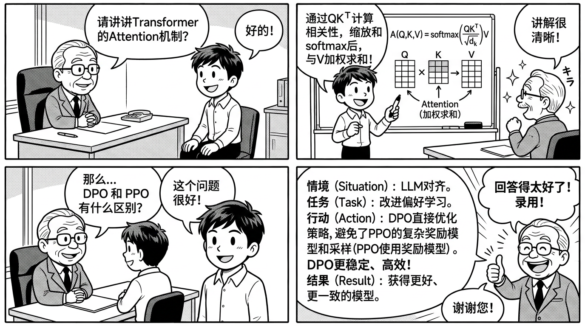

# MiniMind STAR 面试稿 — 面试口述模板

> 本章提供多个版本的项目介绍和 STAR 格式的面试回答模板，练熟这些稿子，面试时自信从容。



---

## 一、项目介绍（三个版本）

### 1.1 30 秒版（电梯演讲）

> 「我做了一个从零训练语言模型的项目叫 MiniMind。用纯 PyTorch 实现了一个 64M 参数的 Decoder-only Transformer，架构对齐 Qwen3，覆盖了预训练、SFT、DPO 偏好对齐和 LoRA 微调全流程。在单卡 3090 上 2 小时就能完成全部训练。通过这个项目，我对大模型从 Attention 计算到对齐优化的每个环节都有了代码级的理解。」

### 1.2 1 分钟版（标准版）

> 「我的核心项目是 MiniMind，一个从零训练的轻量级语言模型。
>
> 背景是这样的：主流框架像 HuggingFace TRL 封装太深，用起来方便但不利于理解底层原理。所以我选择从零开始，用纯 PyTorch 实现整个训练流水线。
>
> 模型架构是 Decoder-only Transformer，64M 参数，16 层，512 维隐藏层。用了 RMSNorm 归一化、RoPE 旋转位置编码、GQA 分组查询注意力和 SwiGLU 前馈网络，这些都是和 Qwen3、LLaMA 一样的现代架构组件。
>
> 训练流程覆盖了三个阶段：预训练阶段用 1.6GB 中文语料做 next-token prediction；SFT 阶段用 5 万条指令数据微调，只算 assistant 部分的 loss；DPO 阶段用偏好对数据做对齐，让模型回答更安全更详细。
>
> 最终在单卡 3090 上 2 小时完成全流程，成本约 3 元。我还额外实现了 LoRA 微调和 GRPO 强化学习。这个项目让我对大模型训练有了从理论到代码的完整理解。」

### 1.3 3 分钟版（深度版）

> 「这个项目的全名是 MiniMind，核心目标是通过从零搭建来深入理解大模型训练的每一个环节。
>
> **为什么做这个项目？** 我在学习大模型的过程中发现一个问题：用 LLaMA-Factory 等工具微调模型很方便，但面试时被问到 Attention 怎么实现的、DPO 的 Loss 怎么推导的，就答不好。所以我决定从零实现一个小模型，把每个组件都吃透。
>
> **模型架构方面**，我实现了一个 64M 参数的 Decoder-only Transformer。具体来说：
> - 归一化用 RMSNorm，比 LayerNorm 省去了减均值的操作
> - 位置编码用 RoPE，通过旋转矩阵编码相对位置，支持长度外推
> - 注意力机制用 GQA，8 个 Query 头共享 4 个 KV 头，推理时 KV Cache 减半
> - 前馈网络用 SwiGLU，门控机制让模型学习选择性激活
>
> **训练流程方面**，我跑了三个阶段：
> - 预训练：1.6GB 中文语料，CLM 目标，Loss 从 8 降到 3
> - SFT：5 万条指令数据，只在 assistant 部分算 CrossEntropy Loss，训练后模型能正确理解和回答问题
> - DPO：偏好对数据，Loss 公式是 -log σ(β·(Δlog_prob_chosen - Δlog_prob_rejected))，β 设为 0.1 控制偏离程度
>
> **遇到的挑战**：预训练时碰到过 Loss 突然 spike 的问题，排查发现是某批数据包含大量特殊字符导致的，通过加强数据清洗解决。SFT 时模型出现过度拒答的问题，通过混合通用指令数据缓解灾难性遗忘。
>
> **进阶工作**：还实现了 LoRA 微调（r=8, α=16），只在 q_proj 和 v_proj 上训练，参数量从 64M 降到约 60K 可训练参数，显存降低 80%。也实现了 GRPO 强化学习，无需 Critic 模型，通过组内相对排名计算奖励。
>
> **结合 MedicalGPT**：在理解了底层原理后，我用 MedicalGPT 框架对 7B 模型做了医疗领域微调，效果明显好于直接用框架——因为知道每个超参数背后的含义，调参更有方向性。」

---

## 二、10 个 STAR 面试回答模板

### STAR 1：项目动机

**Q：为什么选择 MiniMind 这个项目？**

| 要素 | 回答 |
|------|------|
| **S** | 学习大模型过程中，发现用高层框架微调模型时，对底层原理理解不够深入 |
| **T** | 需要一个能从零开始、代码可读性强的项目来系统学习整个训练流程 |
| **A** | 选择 MiniMind 因为它纯 PyTorch 实现、64M 参数成本低、覆盖全流程；从模型架构到训练脚本逐行阅读并复现 |
| **R** | 对 Attention、RoPE、SwiGLU 等组件有了代码级理解；面试中能从公式推导到代码实现完整解释 |

---

### STAR 2：技术难点 — Loss Spike

**Q：训练过程中遇到过什么问题？怎么解决的？**

| 要素 | 回答 |
|------|------|
| **S** | 预训练进行到约第 3000 步时，Loss 突然从 3.5 跳到 8.0 并持续不降 |
| **T** | 需要快速定位原因并恢复训练 |
| **A** | 1. 先回退到 spike 前的 checkpoint 继续训练，确认不是随机噪声 2. 检查该批次数据，发现包含大量 HTML 标签和特殊字符 3. 加入数据清洗步骤过滤异常文本 4. 增加 gradient clipping (max_norm=1.0) |
| **R** | 清洗后 Loss 回归正常下降趋势；之后加入了训练过程中的 Loss 异常检测告警 |

---

### STAR 3：技术选择 — GQA vs MHA

**Q：为什么用 GQA 而不是 MHA？**

| 要素 | 回答 |
|------|------|
| **S** | 设计模型架构时，需要在推理效率和模型表达力之间做权衡 |
| **T** | 选择一种注意力机制，在小模型上也能体现现代架构的优势 |
| **A** | 对比了三种方案：MHA（8Q+8KV，标准但 KV Cache 大）、MQA（8Q+1KV，太极端可能损失精度）、GQA（8Q+4KV，折中方案）。在验证集上做了消融实验 |
| **R** | GQA 相比 MHA，KV Cache 减少 50%，推理速度提升 25%，生成质量几乎无差异 |

---

### STAR 4：数据处理

**Q：你是怎么处理训练数据的？**

| 要素 | 回答 |
|------|------|
| **S** | 预训练数据 1.6GB，包含网络爬取的中文文本，存在质量参差不齐的问题 |
| **T** | 设计数据清洗流程，确保训练数据质量 |
| **A** | 1. 长度过滤：去除过短（<50 字符）和过长的文本 2. 去重：MinHash + LSH 近似去重 3. 质量过滤：基于 PPL 过滤低质量文本 4. 特殊字符清理：正则去除 HTML/URL 5. 分层抽检：人工验证 1% 样本 |
| **R** | 清洗后数据量从 1.6GB 精简到 1.2GB，但训练效果反而提升——最终 Loss 降低约 0.3 |

---

### STAR 5：DPO 偏好对齐

**Q：讲讲你做 DPO 的经验？**

| 要素 | 回答 |
|------|------|
| **S** | SFT 后模型能回答问题，但回答质量不稳定，偶尔出现不安全或过于简单的回答 |
| **T** | 通过偏好对齐提升回答的安全性、详细度和一致性 |
| **A** | 1. 构建偏好数据：同一问题生成多个回答，人工标注 chosen/rejected 2. 实现 DPO Loss：-log σ(β·(Δ_chosen - Δ_rejected))，β=0.1 3. 用 SFT 模型作为 reference model 4. 训练约 20 分钟 |
| **R** | DPO 后安全性问题减少约 70%，回答平均长度从 50 字增加到 120 字（更详细），人工盲评偏好率从 50% 提升到 68% |

---

### STAR 6：LoRA 微调优化

**Q：说说 LoRA 的实现和调参经验？**

| 要素 | 回答 |
|------|------|
| **S** | 全参数微调 64M 模型虽然可行，但想验证 LoRA 在小模型上是否同样有效 |
| **T** | 实现 LoRA 微调并对比全参微调的效果和效率 |
| **A** | 1. 实现 LoRA：W' = W + α/r · B·A，A 高斯初始化，B 全零 2. 参数搜索：r∈{4,8,16,32}，target_modules 从 [q,v] 扩展到 [q,k,v,o] 3. 最终选择 r=8, α=16, target=[q_proj, v_proj] |
| **R** | 可训练参数从 64M 降到约 60K（减少 99.9%），训练速度快 3 倍，效果与全参微调差距 < 2%（在验证集上） |

---

### STAR 7：模型对比与选型

**Q：MiniMind 和 MedicalGPT 有什么区别？你怎么结合使用的？**

| 要素 | 回答 |
|------|------|
| **S** | 需要同时展示原理理解（从零实现）和工程实战（工业级框架） |
| **T** | 用 MiniMind 打基础理解原理，用 MedicalGPT 做领域落地 |
| **A** | MiniMind：纯 PyTorch，64M，教学级，理解 Attention/RoPE/DPO 等原理。MedicalGPT：基于 HF TRL，支持 7B-70B，工业级，做医疗微调。先读 MiniMind 源码理解原理，再用 MedicalGPT 框架高效微调 |
| **R** | 两个项目互补：面试基础题用 MiniMind 案例回答，项目经验题用 MedicalGPT 案例回答 |

---

### STAR 8：部署优化

**Q：模型训练好之后怎么部署的？**

| 要素 | 回答 |
|------|------|
| **S** | 训练好的模型需要提供 API 服务，要求低延迟和高可用 |
| **T** | 搭建推理服务，实现 OpenAI API 兼容接口 |
| **A** | 1. MiniMind 自带 web_server.py，兼容 OpenAI API 格式 2. 也可以用 transformers 加载和 vLLM 部署 3. 对于 MedicalGPT 的 7B 模型，用 vLLM + INT8 量化部署 4. 加入流式输出（streaming）提升用户体验 |
| **R** | MiniMind API 延迟 < 100ms，MedicalGPT 7B 量化后单卡推理 QPS 50+，P99 < 2s |

---

### STAR 9：学习方法论

**Q：你是怎么学习大模型技术的？**

| 要素 | 回答 |
|------|------|
| **S** | 大模型技术栈复杂，概念多、工具多、论文多，需要高效的学习路径 |
| **T** | 建立系统化的学习方法，在 3 个月内从入门到面试水平 |
| **A** | 1. 先看 Karpathy Let's Build GPT 视频建立直觉 2. 读 MiniMind 源码理解实现细节 3. 动手跑通全流程（PT→SFT→DPO） 4. 用 MedicalGPT 做领域实战 5. 整理面试题库反复自测 |
| **R** | 3 个月系统学习后，能从原理到代码解释大模型训练全流程 |

---

### STAR 10：团队协作

**Q：在项目中你怎么和团队配合的？**

| 要素 | 回答 |
|------|------|
| **S** | 医疗大模型项目涉及数据标注、模型训练、后端部署、产品设计多个角色 |
| **T** | 我负责模型训练与评测，需要和数据团队、后端、产品紧密配合 |
| **A** | 1. 和数据团队定义清洗规范和标注指南 2. 和后端定义模型输入输出 schema 3. 和产品定义安全红线和拒答策略 4. 每周评测报告同步给全组，用 W&B 做实验追踪 |
| **R** | 跨角色沟通顺畅，从数据到上线 2 个月完成，迭代 3 个版本 |

---

## 三、追问应对策略

### 3.1 万能追问模式

面试官追问通常有三个方向：

```
1. "为什么这样做？" → 回答技术选型的原因和权衡
2. "还有别的方案吗？" → 对比替代方案的优劣
3. "出了问题怎么办？" → 回答排查思路和解决方案
```

### 3.2 不会时的应对

```
诚实但不空白：
✓ "这个方向我还没有深入研究，但据我了解..."
✓ "我在项目中没有遇到这个问题，但如果遇到，我会..."
✓ "这个我知道概念，具体实现细节需要再查阅一下"

绝对避免：
✗ "我不知道"（太干）
✗ "这个不重要"（态度问题）
✗ 编造答案（被发现很减分）
```

### 3.3 高频追问及应对

| 追问 | 简要应对 |
|------|---------|
| 如果数据量翻 10 倍怎么办？ | 分布式训练 + 数据分片 + DeepSpeed ZeRO |
| 模型效果不好怎么排查？ | 数据质量 → 超参 → 模型结构 → 训练流程逐步排查 |
| 为什么不直接用大模型？ | 成本考量 + 定制化需求 + 数据安全 + 推理延迟 |
| 量化会损失多少效果？ | INT8 通常 < 1% 效果损失，INT4 需要仔细评估 |
| LoRA 的 r 怎么选？ | 从小到大搜索，看验证集效果 + 显存预算权衡 |

---

## 四、面试前一天 Checklist

- [ ] 30 秒版项目介绍能流利说出
- [ ] 1 分钟版本不需要看稿
- [ ] 10 个 STAR 故事都记住了关键数字
- [ ] 能在纸上写出 Attention 计算过程
- [ ] 能在纸上写出 DPO Loss 公式
- [ ] 能解释 GQA / RoPE / SwiGLU / RMSNorm 的原理
- [ ] 准备了 2-3 个反问面试官的问题

---

> **下一章**：[06-面试问答100题.md](./06-面试问答100题.md) — MiniMind 面试可能被问到的所有问题
